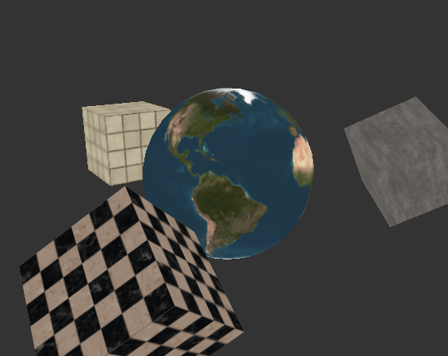

# A simple scene with controllable camera in opengl 4.5 + glfw

---

## Building on Windows
Clone this repo together with its submodules.
```
$ mkdir learngl
$ cd learngl
$ git clone --recurse-submodules "https://github.com/dweller4085/learngl.git" .
```

Build **glfw** and **glm** with CMake + Visual Studio 2022 into their default locations.

**Make sure glfw is compiled with `/MDd` compiler option!**

You should end up with `glfw3.lib` at `lib\glfw\build\src\Debug`, and `glm.lib` at `lib\glm\build\src\Debug`.

Run ` $ build.bat ` under the `x64 Native Tools Command Prompt for VS 2022` and it should build the executable at `bin\learngl.exe`.

If you get assertion failures on launch, try running the executable with you current working directory being exactly `learngl\bin\`, or change the texture paths in `app.cc` to absolute paths.

## Controls
`esc`: toggle camera movement on and off (enable / disable cursor)

`w` `a` `s` `d`: move forwards, left, backwards, right

`left shift`: hold to move at 0.33 default speed

`left ctrl`: move down

`space`: move up

---

https://www.youtube.com/watch?v=KFrzDdlsnJo


